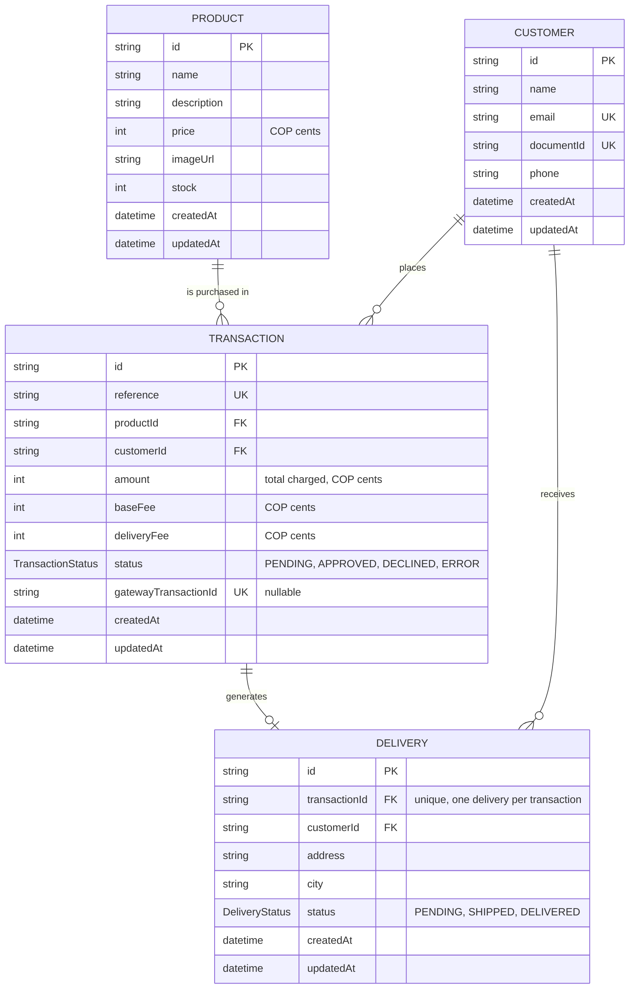

# Payment Integrator — Checkout Challenge

Monorepo con la solución completa a un flujo de compra de un producto, pagado con tarjeta a través de un proveedor de pagos externo (sandbox). Dos proyectos independientes:

- **[`payment-integrator-api`](payment-integrator-api)** — backend en NestJS + Prisma + PostgreSQL, arquitectura hexagonal.
- **[`payment-integrator-webui`](payment-integrator-webui)** — frontend en React + Redux Toolkit, organizado por feature.

## Descripción general

Un cliente ve un producto disponible, ingresa sus datos de entrega y de tarjeta, y paga. El backend valida stock, cobra a través del proveedor de pagos, y — según el resultado — descuenta stock y genera un registro de entrega. Todo el dinero es simulado (ver [nota de sandbox](#entorno-sandbox-sin-dinero-real) al final).

El flujo de negocio se diseñó en 5 pantallas:

1. **Producto** — muestra el producto disponible, su precio y el stock actual.
2. **Datos de entrega y tarjeta** — formulario de entrega (nombre, email, documento, teléfono, dirección, ciudad) y un modal que tokeniza la tarjeta directamente contra el proveedor de pagos.
3. **Resumen de compra** — desglose del cobro (producto + fee base + fee de envío) y confirmación de pago.
4. **Estado del pago** — pantalla de espera mientras el backend confirma la transacción con el proveedor (hasta ~20s, vía polling).
5. **Resultado** — aprobado, rechazado o error, con un botón para volver al producto (que refresca el stock ya actualizado).

En el frontend estas 5 pantallas se implementan sobre 4 rutas (`/`, `/checkout`, `/summary`, `/result`): la quinta ("volver al producto con stock fresco") reutiliza `/`, que siempre re-consulta el producto al montarse.

## Arquitectura

### Backend — hexagonal (Ports & Adapters)

```
payment-integrator-api/
├── docker-compose.yml
├── .env.example
├── prisma/
│   ├── schema.prisma
│   ├── seed.ts
│   └── migrations/
└── src/
    ├── main.ts                        # bootstrap, ValidationPipe global, Swagger
    ├── app.module.ts
    ├── domain/                        # entidades, errores de dominio, puertos (interfaces) — sin deps de framework/Prisma
    │   ├── customer/
    │   ├── delivery/
    │   ├── payment/                   # PaymentGatewayPort (puerto hacia el proveedor de pagos)
    │   ├── product/
    │   └── transaction/
    ├── application/                   # un use case por operación de negocio, retorna Result<T, E>
    │   ├── customer/                  # UpsertCustomerUseCase
    │   ├── product/                   # ListProductsUseCase, GetProductByIdUseCase
    │   └── transaction/                # CreateTransactionUseCase, ConfirmPaymentUseCase, GetTransactionUseCase
    ├── infrastructure/                # adaptadores
    │   ├── http/                      # controllers + DTOs (class-validator) + to-http-exception.ts
    │   │   ├── customer/
    │   │   ├── product/
    │   │   └── transaction/
    │   ├── persistence/                # repositorios Prisma
    │   │   ├── prisma/
    │   │   └── repositories/
    │   └── payment-gateway/            # cliente HTTP hacia el proveedor de pagos (PaymentGatewayHttpClient)
    └── common/                         # Result<T,E>, DomainError, TransactionContext
```

Los controllers traducen el `Result` de cada use case a status HTTP en un único punto ([`to-http-exception.ts`](payment-integrator-api/src/infrastructure/http/to-http-exception.ts)): `*_NOT_FOUND` → 404, conflictos de negocio (`INSUFFICIENT_STOCK`, `TRANSACTION_ALREADY_PROCESSED`) → 409, cualquier otro `DomainError` → 422.

### Frontend — organizado por feature

```
payment-integrator-webui/
├── .env.example
└── src/
    ├── main.tsx
    ├── App.tsx                        # rutas: /, /checkout, /summary, /result
    ├── app/
    │   ├── store.ts                   # Redux store + redux-persist (whitelist: product, checkout, payment)
    │   ├── hooks.ts
    │   └── localStorageEngine.ts
    ├── features/
    │   ├── product/                   # ProductPage, productSlice
    │   ├── checkout/                  # CheckoutPage, DeliveryForm, CardModal, cardValidation, deliveryValidation, checkoutSlice
    │   ├── payment/                   # SummaryPage, paymentSlice, paymentProviderClient, paymentCalculations
    │   └── result/                    # ResultPage
    └── shared/
        ├── api/httpClient.ts          # cliente axios hacia nuestro propio backend
        ├── components/                # Button, Modal, Backdrop
        ├── config/env.ts              # variables de entorno de Vite
        └── utils/currency.ts
```

Cada feature agrupa su página, su slice de Redux y su lógica de validación/cálculo. `shared/` sólo contiene lo verdaderamente transversal (cliente HTTP, componentes de UI genéricos, config, utilidades).

## Modelo de datos

Definido en [`payment-integrator-api/prisma/schema.prisma`](payment-integrator-api/prisma/schema.prisma).



- **Product** — artículo del catálogo disponible para compra, con su precio (en centavos COP) y `stock` actual. Cada transacción referencia un único producto.
- **Customer** — el comprador, identificado de forma única por `email` y `documentId`. Puede acumular múltiples transacciones y entregas.
- **Transaction** — registro de un intento de compra: enlaza un `Product` con un `Customer`, carga el `amount` calculado (`baseFee` + `deliveryFee`), y sigue su ciclo de vida vía `TransactionStatus`, desde `PENDING` hasta su resolución contra el proveedor de pagos (`gatewayTransactionId` la correlaciona con el registro del proveedor).
- **Delivery** — se crea solo cuando una transacción queda `APPROVED`; guarda `address`/`city` y su propio ciclo de vida (`DeliveryStatus`), independiente del estado del pago. La restricción `unique` en `transactionId` garantiza como máximo una entrega por transacción.

## Decisiones de diseño y trade-offs

### 1. Reserva atómica de stock antes de llamar al proveedor de pagos

**Qué decidimos:** `POST /transactions` solo *verifica* stock (`Product.hasSufficientStock`) — no lo reserva. La reserva real ocurre un paso más tarde, dentro de `ConfirmPaymentUseCase`: el stock se decrementa de forma **atómica** con un `UPDATE` condicional (`stock = stock - 1 WHERE id = ? AND stock >= 1`), **antes** de llamar al proveedor de pagos.

**Condición de carrera que resuelve:** dos transacciones `PENDING` concurrentes podrían pasar la verificación inicial para la misma última unidad disponible. Al mover la reserva real al momento de la confirmación —como un único `UPDATE` condicional— solo una de las dos puede ganarla: si el `UPDATE` afecta 0 filas, la transacción perdedora se marca `ERROR` de inmediato y el proveedor de pagos nunca es invocado, así que nadie es cobrado por algo que no se puede entregar. Si el proveedor termina rechazando o fallando el cobro, la reserva se libera con un `incrementStock` compensatorio.

**Alternativa de producción real:** reservar el stock ya en la creación de la transacción, con un "hold" temporal (TTL) liberado por un job de background si la transacción no se confirma dentro de una ventana de tiempo. Evitaría el escenario (aceptable en este alcance) de que `POST /transactions` reporte stock disponible que luego se pierde en la carrera de confirmación, a costa de la complejidad de gestionar expiración de reservas.

### 2. Polling con timeout vs. webhook para confirmar el pago

**Qué decidimos:** las transacciones del proveedor de pagos se crean siempre `PENDING` y se resuelven de forma asíncrona — no hay una respuesta síncrona de "cobrado". `ConfirmPaymentUseCase` (vía `PaymentGatewayHttpClient`) hace polling a `GET /transactions/:id` cada ~2s, hasta 10 intentos (~20s). Si la transacción sigue `PENDING` al agotar ese presupuesto, se trata como una falla del proveedor (`PaymentGatewayError`) y la transacción local se marca `ERROR` — nunca queda `PENDING` indefinidamente.

**Por qué:** el enfoque correcto en producción es un webhook (`PAYMENT_GATEWAY_EVENTS_KEY` ya está provisionada para su verificación de firma), pero un webhook requiere un endpoint públicamente alcanzable y manejo de eventos entrantes, fuera del alcance de este ejercicio.

**Alternativa de producción real:** confirmación dirigida por webhook (firmada con `PAYMENT_GATEWAY_EVENTS_KEY`), dejando el polling únicamente como job de reconciliación de respaldo — no como camino principal. Esto elimina la espera bloqueante del lado del cliente y el timeout artificial de ~20s.

### 3. `prisma.$transaction()` nativo, sin un Unit-of-Work genérico

**Qué decidimos:** dentro de `ConfirmPaymentUseCase` hay tres pasos, no dos: (1) la reserva de stock (`decrementStock`) es un `UPDATE` condicional propio, ejecutado **antes** de llamar al proveedor y **deliberadamente fuera** de cualquier transacción de Postgres; (2) se llama al proveedor de pagos (la llamada HTTP con polling, que puede tardar hasta ~20s); (3) según el resultado, se agrupan en un `prisma.$transaction()` real las escrituras que deben tener éxito o fallar juntas: en aprobación, `markAsProcessed(APPROVED)` + `Delivery.create`; en liberación, `incrementStock` (compensatorio) + `markAsProcessed(DECLINED/ERROR)`. El cliente transaccional (`tx`) se pasa como parámetro opcional a los métodos de repositorio existentes (`TransactionRepository.runAtomically`, y `tx?` en `decrementStock`/`incrementStock`/`markAsProcessed`/`Delivery.create`).

**Por qué:** mantener una transacción de Postgres abierta durante una llamada HTTP externa lenta (el polling de ~20s) arriesgaría agotar el pool de conexiones y toparse con timeouts de idle/lock — un anti-patrón conocido. La reserva inicial ya es atómica por sí sola (un único `UPDATE` condicional), así que no necesita envoltura extra.

**Por qué no un Unit-of-Work completo:** hay un solo caso de uso (`ConfirmPaymentUseCase`) con necesidad real de atomicidad multi-escritura. Introducir una abstracción genérica de Unit-of-Work/`TransactionManager` (puerto + implementación + wiring en el contenedor de DI) sería infraestructura especulativa para un único llamador.

**Alternativa de producción real:** si aparecieran más casos de uso con transacciones multi-repositorio, ahí sí valdría la pena extraer un puerto `UnitOfWork`/`TransactionManager` en `domain/`, para no atar los use cases a la API concreta de Prisma.

## Validaciones implementadas

### Backend

- **Pipe global** (`main.ts`): `ValidationPipe({ whitelist: true, forbidNonWhitelisted: true, transform: true })` — rechaza cualquier campo no declarado en el DTO y transforma tipos automáticamente.
- **`CreateCustomerDto`**: `name` (string, no vacío), `email` (formato de email válido), `documentId` (string, no vacío), `phone` (número telefónico válido para Colombia, `@IsPhoneNumber('CO')`).
- **`CreateTransactionDto`**: `productId` y `customerId` deben ser UUID válidos.
- **`ConfirmPaymentDto`**: `cardToken`, `deliveryAddress` y `deliveryCity` como strings no vacíos.
- **Reglas de dominio** (no HTTP, pero mapeadas a status codes vía `to-http-exception.ts`): producto/cliente/transacción inexistentes → 404 (`ProductNotFoundError`, `CustomerNotFoundError`, `TransactionNotFoundError`); stock insuficiente al crear la transacción → 409 (`InsufficientStockError`); intentar confirmar una transacción que ya no está `PENDING` → 409 (`TransactionAlreadyProcessedError`).
- **Restricciones a nivel de base de datos** (`schema.prisma`): `Customer.email` y `Customer.documentId` únicos; `Transaction.reference` y `Transaction.gatewayTransactionId` únicos; `Delivery.transactionId` único (máximo una entrega por transacción).
- **Concurrencia**: `decrementStock` es un `UPDATE` condicional (`WHERE stock >= quantity`) — nunca deja el stock en negativo aunque dos confirmaciones lleguen al mismo tiempo.

### Frontend

- **`cardValidation.ts`**: algoritmo de Luhn sobre el número de tarjeta; detección de marca limitada a Visa y Mastercard (`detectCardBrand`) — cualquier otro prefijo se considera `unknown` y no pasa la validación; longitud de número entre 13 y 19 dígitos; CVV de 3 dígitos (mismo largo para ambas marcas soportadas); fecha de expiración (`MM`/`AA`) válida y no vencida respecto a la fecha actual.
- **`deliveryValidation.ts`**: nombre, documento, dirección y ciudad obligatorios (no vacíos tras `trim`); email validado contra una regex simple; teléfono validado contra una regex que acepta 7–15 dígitos con `+` opcional.
- **`CardModal`**: el botón de submit queda deshabilitado por estado (`formValid`) hasta que número, expiración, CVV y titular sean válidos; los inputs de número/mes/año/CVV filtran cualquier caracter no numérico y limitan la longitud en el propio `onChange`.
- **`CheckoutPage`**: no permite continuar a menos que el formulario de entrega sea válido (`isDeliveryFormValid`) y ya exista un token de tarjeta (`checkout.card.token`).

## Manejo seguro de datos sensibles

El número de tarjeta y el CVV **nunca llegan a este backend ni se persisten en ningún lado**:

1. El usuario ingresa los datos de la tarjeta en `CardModal`, que los guarda solo en estado local de React (no en el store de Redux) mientras dura el envío.
2. `paymentProviderClient` (frontend) llama **directamente** a la API del proveedor de pagos con la **llave pública** (`VITE_PAYMENT_PROVIDER_PUBLIC_KEY`) para tokenizar la tarjeta — esta llamada nunca pasa por nuestro backend (`httpClient`, que apunta a nuestra propia API, es un cliente axios distinto).
3. El proveedor responde con un token opaco + metadata segura de mostrar (marca, últimos 4 dígitos). Solo eso se guarda en `checkoutSlice` — y por lo tanto en el `localStorage` persistido por `redux-persist` — nunca el PAN ni el CVV.
4. El frontend envía ese `cardToken` (nunca el número de tarjeta) al backend, en `ConfirmPaymentDto.cardToken`.
5. El backend usa el token para cobrar contra el proveedor, autenticado con la **llave privada** (`PAYMENT_GATEWAY_PRIVATE_KEY`), que vive solo en variables de entorno del servidor y nunca se loguea ni se expone a un cliente.
6. La firma de integridad de cada cobro se calcula con `PAYMENT_GATEWAY_INTEGRITY_SECRET` (SHA-256 sobre `reference + amount + currency + secret`), también backend-only.
7. `PAYMENT_GATEWAY_EVENTS_KEY` está provisionada para la verificación de firma de un futuro webhook, pero no se usa hoy (ver [Polling vs. webhook](#2-polling-con-timeout-vs-webhook-para-confirmar-el-pago)).

**Qué nunca se persiste:** el `schema.prisma` no tiene ninguna columna para número de tarjeta, CVV o fecha de expiración — `Transaction` solo guarda `gatewayTransactionId` (un identificador opaco de correlación) y montos. Los logs de errores del cliente HTTP hacia el proveedor (`describeError`) registran únicamente status HTTP y tipo de error, nunca el cuerpo de la petición (que contendría el token o las llaves). `.env` está en `.gitignore` en ambos proyectos; los `.env.example` solo documentan qué variables existen, sin valores reales.

## Instalación y ejecución local

### Backend (`payment-integrator-api`)

```bash
cd payment-integrator-api
cp .env.example .env       # completar DATABASE_URL y las PAYMENT_GATEWAY_* (llaves sandbox del proveedor)

docker compose up -d       # PostgreSQL 16
npx prisma migrate dev     # aplica migraciones
npx prisma db seed         # 5 productos de prueba

npm install
npm run start:dev
```

- API: `http://localhost:3000`
- Swagger: `http://localhost:3000/api/docs`

### Frontend (`payment-integrator-webui`)

```bash
cd payment-integrator-webui
cp .env.example .env       # VITE_API_BASE_URL, VITE_PAYMENT_PROVIDER_API_BASE_URL, VITE_PAYMENT_PROVIDER_PUBLIC_KEY

npm install
npm run dev
```

- WebUI: `http://localhost:5173` (puerto por defecto de Vite)

> El backend debe estar corriendo (con sus migraciones y seed aplicados) para que el frontend tenga un producto que mostrar.

## Tests

### Backend

```bash
cd payment-integrator-api
npm run test        # unit tests
npm run test:cov    # unit tests + reporte de cobertura
```

Resultado real de `npm run test:cov` (26 jul 2026):

```
Test Suites: 8 passed, 8 total
Tests:       31 passed, 31 total
Snapshots:   0 total
Time:        4.972 s

---------------------------------------------|---------|----------|---------|---------|
File                                          | % Stmts | % Branch | % Funcs | % Lines |
---------------------------------------------|---------|----------|---------|---------|
All files                                     |   33.51 |    21.25 |   40.15 |   34.37 |
 src/application/customer                     |     100 |      100 |     100 |     100 |
 src/application/product                      |     100 |      100 |     100 |     100 |
 src/application/transaction                  |     100 |      100 |     100 |     100 |
 src/common                                    |     100 |      100 |     100 |     100 |
 src/domain/customer                           |   85.71 |      100 |   77.77 |   85.71 |
 src/domain/delivery                           |    8.33 |      100 |       0 |    8.33 |
 src/domain/payment                            |     100 |      100 |     100 |     100 |
 src/domain/product                            |      75 |      100 |   58.33 |      75 |
 src/domain/transaction                        |   79.16 |      100 |   66.66 |   79.16 |
 src/infrastructure/*                          |    0–6  |     0–20 |    0–8  |    0–8  |
---------------------------------------------|---------|----------|---------|---------|
```

La cobertura está concentrada intencionalmente en la capa de aplicación (100% statement/branch en los tres módulos de `application/`), que es donde vive la lógica de negocio. La capa de `infrastructure/` (repositorios Prisma, cliente HTTP del proveedor, controllers) se valida mediante corridas manuales end-to-end contra una base de datos real y el sandbox del proveedor, no con unit tests mockeados — de ahí su 0% en este reporte.

### Frontend

```bash
cd payment-integrator-webui
npm run test
```

No hay script de cobertura configurado para el frontend todavía (`package.json` solo define `test` y `test:watch`).
