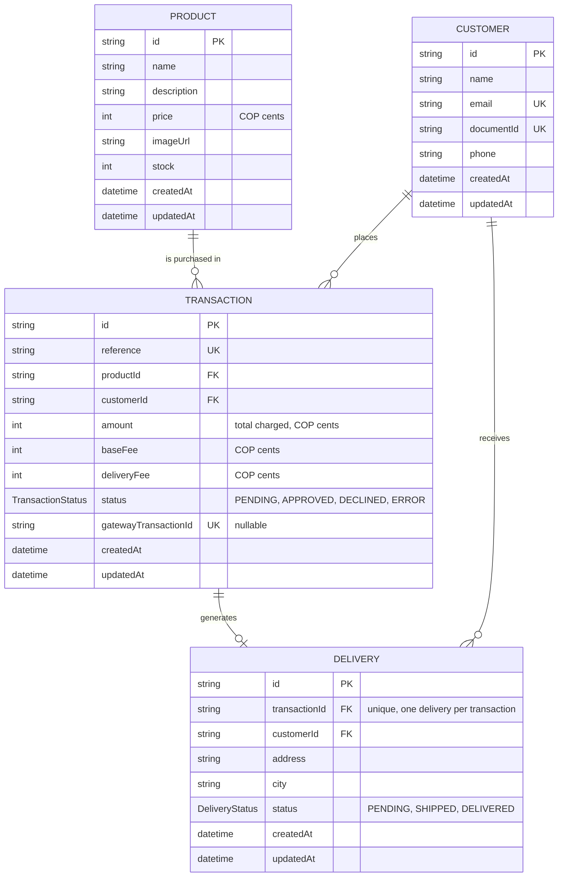

# Payment Integrator API

Backend for a product purchase flow paid through a card payment gateway, built with NestJS + Prisma + PostgreSQL, following hexagonal architecture (Ports & Adapters) and Railway-Oriented Programming for business error handling.

## Business flow

1. A customer sees a product with available stock.
2. The **frontend** tokenizes the card directly against the payment gateway's API (public key) — the card number never reaches this backend.
3. The frontend sends the card token + delivery data to this API.
4. `POST /transactions` creates a `PENDING` transaction (validates product/customer, computes the total with fees).
5. `POST /transactions/:id/confirm` receives the card token, charges it through the payment gateway (private key), and — based on the result — updates the transaction, decrements stock, and creates the delivery record.

## Architecture

Hexagonal (Ports & Adapters), organized by layer at the top level of `src/`:

- **`domain/`** — business entities, domain errors, and repository/gateway **ports** (interfaces). No framework or Prisma dependency.
- **`application/`** — one use case per business operation (`CreateTransactionUseCase`, `ConfirmPaymentUseCase`, etc.). Use cases return a `Result<T, E>` ([`src/common/result.ts`](src/common/result.ts)) instead of throwing for *expected* business outcomes ("insufficient stock" is a result, not an exception). Unexpected/impossible states (e.g. a transaction referencing a deleted customer) still throw — `Result` is reserved for outcomes the caller is meant to branch on.
- **`infrastructure/`** — adapters: HTTP controllers + DTOs (`infrastructure/http/`), Prisma repositories (`infrastructure/persistence/`), and the payment gateway HTTP client (`infrastructure/payment-gateway/`).

Controllers decide the HTTP status from the `Result` via a single mapping point ([`to-http-exception.ts`](src/infrastructure/http/to-http-exception.ts)): `*_NOT_FOUND` → 404, business conflicts (`INSUFFICIENT_STOCK`, `TRANSACTION_ALREADY_PROCESSED`) → 409.

## Modelo de datos

Definido en [`prisma/schema.prisma`](prisma/schema.prisma).



- **Product** — catalog item available for purchase, with its price (in COP cents) and current `stock`. Each transaction references the single product it's paying for.
- **Customer** — the buyer, identified uniquely by `email` and `documentId`. A customer can accumulate multiple transactions and deliveries over time.
- **Transaction** — the record of a purchase attempt: links one `Product` to one `Customer`, carries the computed `amount` (`baseFee` + `deliveryFee`), and tracks its lifecycle through `TransactionStatus` as it's created `PENDING` and later resolved against the payment gateway (`gatewayTransactionId` correlates it with the gateway's own record).
- **Delivery** — created only once a transaction is `APPROVED`; holds the shipping `address`/`city` and its own `DeliveryStatus` lifecycle, independent of the payment status. The `transactionId` unique constraint enforces at most one delivery per transaction.

## Setup

### 1. Environment variables

```bash
cp .env.example .env
```

Fill in `DATABASE_URL` and the `PAYMENT_GATEWAY_*` keys (sandbox keys from your payment gateway provider). `PAYMENT_GATEWAY_PUBLIC_KEY` is the only one meant to reach the frontend, for card tokenization — `PAYMENT_GATEWAY_PRIVATE_KEY` and `PAYMENT_GATEWAY_INTEGRITY_SECRET` stay backend-only and are never logged. `PAYMENT_GATEWAY_EVENTS_KEY` is provisioned for a future webhook but unused today (see [Polling vs. webhook](#polling-vs-webhook-for-payment-confirmation) below).

### 2. Database

```bash
docker compose up -d      # PostgreSQL 16
npx prisma migrate dev    # apply migrations
npx prisma db seed        # 5 dummy products
```

### 3. Run

```bash
npm install
npm run start:dev
```

- API: `http://localhost:3000`
- Swagger docs: `http://localhost:3000/api/docs`

### Tests

```bash
npm run test        # unit tests (use cases + pure infra logic)
npm run test:cov
```

Unit tests focus on the application layer (use cases), per this project's scope — 100% statement/branch coverage there. Infrastructure (Prisma repositories, the payment gateway HTTP client) is validated through real, manual end-to-end runs against a live database and the gateway's sandbox instead of mocked unit tests.

## Design decisions & trade-offs

### Stock concurrency: reservation happens at confirmation, not at creation

`POST /transactions` only *checks* stock (`Product.hasSufficientStock`) — it doesn't reserve it. Two concurrent `PENDING` transactions could both pass that check for the same last unit. This is intentional: reserving stock at creation time would mean holding inventory hostage for transactions that might never be confirmed.

The race is actually closed one step later, in `ConfirmPaymentUseCase`: stock is decremented **atomically** (`UPDATE products SET stock = stock - 1 WHERE id = ? AND stock >= 1`) **before** calling the payment gateway, not after. If the decrement fails (another confirmation won the race), the transaction is marked `ERROR` immediately and the gateway is never called — nobody is charged for a product that can't be fulfilled. If the gateway ends up declining or erroring the charge, the reservation is released with a compensating `incrementStock`. So while `POST /transactions` doesn't reserve stock, no payment can complete against a stock level of zero, and no customer is ever charged for something we can't deliver.

### Atomicity: native `prisma.$transaction()`, no Unit-of-Work abstraction

The one place where multiple writes must succeed or fail together is inside `ConfirmPaymentUseCase`, in two spots:

- **Approval**: `markAsProcessed(APPROVED)` + `Delivery.create`
- **Release**: `incrementStock` (compensating) + `markAsProcessed(DECLINED/ERROR)`

Both pairs are wrapped in `prisma.$transaction()` at the call site, with the transactional client (`tx`) passed as an optional trailing parameter into the existing repository methods (`TransactionRepository.runAtomically`, plus `tx?` on `decrementStock`/`incrementStock`/`markAsProcessed`/`Delivery.create`). This gives real atomicity without introducing a generic Unit-of-Work/TransactionManager port — for a project this size, a full UoW abstraction would be speculative infrastructure with a single caller.

What's deliberately **not** wrapped in that transaction: the initial `decrementStock` reservation, and the gateway HTTP call in between (which can take up to ~20s with polling — see below). Holding a Postgres transaction open across a slow external HTTP call would risk exhausting the connection pool and hitting idle/lock timeouts, a well-known anti-pattern. The initial reservation is already atomic as a single conditional `UPDATE`, so it doesn't need extra wrapping.

### Polling vs. webhook for payment confirmation

Payment gateway transactions are always created `PENDING` and resolve asynchronously — there's no synchronous "charged" response. The correct production approach is a webhook (`PAYMENT_GATEWAY_EVENTS_KEY` is already provisioned for that signature verification), but webhooks require a publicly reachable endpoint and event-driven request handling, which is out of scope for this exercise.

Instead, `ConfirmPaymentUseCase` (via `PaymentGatewayHttpClient`) polls `GET /transactions/:id` on the gateway every ~2s, up to 10 attempts (~20s). If the transaction is still `PENDING` after that budget, it's treated as a gateway failure (`PaymentGatewayError`) and the local transaction is marked `ERROR` — never left `PENDING` indefinitely. In production, this would be replaced by a webhook-driven confirmation (or polling as a fallback reconciliation job, not the primary path), removing the blocking wait and the artificial timeout.

### Known limitation: no 3D Secure redirect flow

The payment gateway's API supports a `redirect_url` for cards that require a 3DS authentication challenge. This backend doesn't send one, since there's no frontend redirect target defined in this exercise's scope — cards that trigger a 3DS challenge in the sandbox won't complete through this flow. The gateway's documented non-3DS sandbox test cards (`4242 4242 4242 4242` approved, `4111 1111 1111 1111` declined) work end-to-end and were used to validate the integration.

### Money as integer cents, not `Decimal`/`float`

`Product.price`, `Transaction.amount/baseFee/deliveryFee` are all `Int` (COP cents), matching the payment gateway's own `amount_in_cents` convention exactly — no float rounding, no `Decimal` conversions at the gateway boundary. `baseFee` and `deliveryFee` are flat constants (`src/application/transaction/pricing.constants.ts`), not computed per-product; every transaction is for exactly one unit (no quantity selector), matching the schema and the described business flow.

## API

See `/api/docs` (Swagger) once the app is running for the full request/response schema of all 6 endpoints:

- `GET /products`
- `GET /products/:id`
- `POST /customers`
- `POST /transactions`
- `POST /transactions/:id/confirm`
- `GET /transactions/:id`
